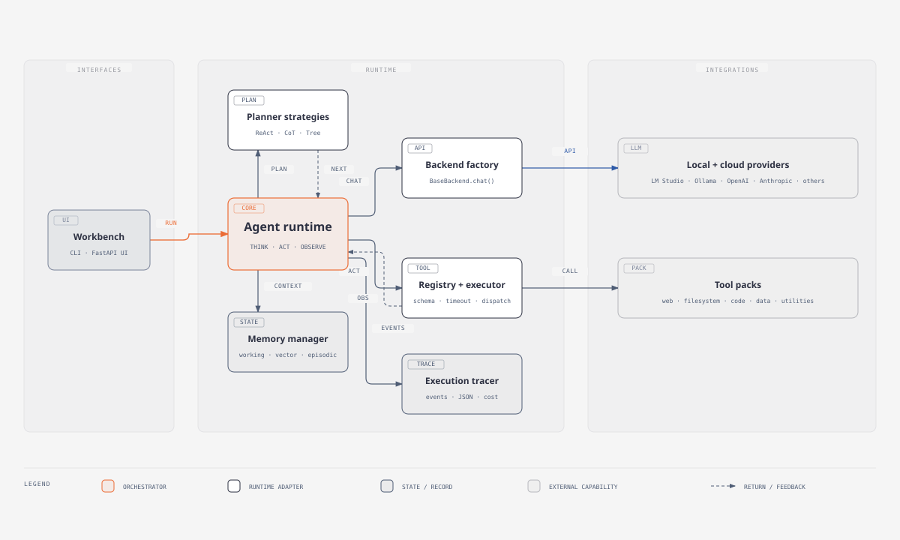

# Agent Playpen
<!-- cSpell:ignore Ollama, Groq -->

<p align="center">
  
</p>

Agent Playpen is a lightweight, modular Python framework for building and running AI agents with local or cloud LLM backends, planner strategies, tool execution, memory, and observability.

The project is designed for experimentation and learning: you can run a local LM Studio model, give an agent tools like web search and file I/O, and let it reason through tasks using a ReAct-style or other planning loop.

This repo is intentionally extensible. You can:

- switch between LLM providers such as LM Studio, OpenAI, Ollama, OpenRouter, Anthropic, Groq, Together, and Azure OpenAI
- choose a planning strategy such as ReAct, CoT, or Tree-of-Thought
- register custom tools that the agent can call
- add memory layers for conversation history or vector retrieval
- trace execution and track estimated token cost

To add a new provider, create a backend class in the `backends/` package and register it in `backends/backend_factory.py` under `BackendFactory.REGISTRY`. The common pattern is to add provider-specific settings to `config/settings.py`, add example variables to `.env.example`, and then read them from the environment or the local `.env` file.

## Why this project exists

The goal is to provide a simple but realistic scaffold for building agentic systems without forcing a heavyweight framework. Rather than hiding the execution loop behind a black box, Agent Playpen makes the flow explicit:

1. the agent receives a task
2. the planner chooses an action strategy
3. the LLM decides what to do next
4. the tool executor invokes a registered tool
5. results are fed back into the reasoning loop

This makes it useful for:

- local AI experimentation with LM Studio or Ollama
- function-calling demos with structured tool schemas
- research assistants that can browse the web and read files
- task-based agents that use memory and iterative reasoning

## Recommended GitHub metadata

If you publish the project publicly, the short repository description and topics should communicate the core idea quickly.

Suggested description:

```text
Lightweight Python framework for experimenting with AI agents, tool calling, memory, and local/cloud LLM backends.
```

Suggested topics:

```text
ai-agents
agent-framework
llm
lm-studio
python
tool-calling
openai
anthropic
ollama
```

## Screenshots

The repo includes generated art and branding assets in the `assets/` folder. These can be embedded directly in the README to make the project feel immediate and more approachable to new users.

```md

```

## Design Philosophy

Agent Playpen was built to explore agent architectures without hiding the important parts behind layers of framework abstraction. The goal is to keep the execution loop understandable, debuggable, and easy to modify.

This is intentionally not a "magic" framework. If you want to know why the agent chose a tool, what the model was asked to do, and what happened next, the code is meant to make that visible rather than bury it in a giant dependency graph.

## Why not LangChain? Why not AutoGen? Why not CrewAI?

Because Agent Playpen was designed to be readable by the person who built it. The project favors a small set of clear abstractions over a large, opinionated ecosystem. This keeps the loop easy to understand, the tool contracts explicit, and the runtime easier to debug when something goes wrong.

In plain terms: the project prioritizes transparency, editability, and local experimentation over framework ceremony.

## Current Status

Agent Playpen is an experimental framework intended for learning, prototyping, and local AI experimentation.

It is not currently positioned as a production-grade agent platform for mission-critical workloads. It is best used when you want to understand how reasoning, tool use, memory, and backend routing fit together in one codebase.

## High-level architecture

The project is organized around a few core concepts:

- Backend: an LLM provider wrapper that exposes a standard chat interface
- Planner: decides how the agent thinks and acts across iterations
- Tool Registry: stores the tools available to the model
- Tool Executor: invokes registered tools with timeout protection
- Memory Manager: keeps conversation or retrieval memory
- Agent: orchestrates the reasoning loop

At runtime, the workbench drives an explicit Think-Act-Observe loop across
planners, model backends, tools, memory, and execution traces:

<p align="center">
  <a href="assets/agent-playpen-architecture.html">
    
  </a>
</p>

<p align="center">
  <sub><a href="assets/agent-playpen-architecture.html">Open the full architecture diagram</a></sub>
</p>

## Supported backends

The project includes backends for multiple providers, all registered in `backends/backend_factory.py`.

Current built-in backends:

- `lm_studio` — local OpenAI-compatible API served by LM Studio
- `ollama` — local Ollama models
- `openai` — OpenAI API
- `anthropic` — Anthropic Claude API
- `azure_openai` — Azure OpenAI
- `groq` — Groq hosted models
- `together` — Together AI models

The default local path is LM Studio, which is the primary target for this project.

## Planner strategies

The planner layer is intentionally modular. The repo includes multiple strategies:

- ReAct planner: reasoning + tool action loop
- CoT planner: chain-of-thought step flow
- Tree planner: more branching/decision-tree style reasoning

The CLI uses the ReAct planner by default.

## Tool system

Each tool extends `tools/base_tool.py` and implements a `run(self, **kwargs) -> str` method. Tools are converted into OpenAI-style function schemas via `to_openai_schema()` so the model can call them using structured arguments.

The tool registry keeps a set of available tools and the executor runs them in a safe thread with a timeout.

Built-in tools currently include:

- web search
- fetch web page content
- read a file from allowed directories
- write a file
- Python REPL sandbox
- calculator
- datetime utilities

Key files:

- `tools/base_tool.py`
- `tools/tool_registry.py`
- `tools/tool_executor.py`
- `tools/packs/...`

## Memory system

The memory layer manages agent context and conversation persistence.

Relevant modules:

- `memory/base_memory.py`
- `memory/memory_manager.py`
- `memory/conversation_buffer.py`

This allows the agent to keep a rolling conversation buffer and optionally retrieve relevant previous context.

## Debugging and observability

The repo also includes traces and cost tracking utilities:

- `debugging/tracer.py`
- `debugging/cost_tracker.py`

These help inspect the reasoning loop, log actions, and estimate usage cost during execution.

## Project structure

```text
Agent Playpen/
├── .env.example
├── .gitignore
├── CHANGELOG.md
├── Extension Guide.txt
├── Full Folder Structure.md
├── Installation and Quick-Start Guide.md
├── LICENSE
├── README.md
├── Start Agent Playpen.cmd
├── advanced/
│   ├── __init__.py
│   ├── evaluator.py
│   ├── guardrails.py
│   ├── prompt_optimizer.py
│   ├── rate_limiter.py
│   ├── self_critique.py
│   ├── multi_agent/
│   │   ├── manager.py
│   │   └── message_bus.py
│   └── streaming/
│       ├── stream_handler.py
│       └── token_streamer.py
├── assets/
│   ├── Cyberpunk goddess/
│   │   ├── favicon.ico
│   │   └── icon-256x256.ico
│   ├── Cyberpunk goddess.png
│   ├── Cyberpunk goddess_2.png
│   ├── Cyberpunk goddess_3.png
│   ├── icons.zip
│   ├── icons (1).zip
│   └── icons (2).zip
├── backends/
│   ├── __init__.py
│   ├── anthropic_backend.py
│   ├── azure_openai.py
│   ├── backend_factory.py
│   ├── base_backend.py
│   ├── groq_backend.py
│   ├── lm_studio.py
│   ├── ollama.py
│   ├── openai_backend.py
│   └── together_backend.py
├── config/
│   ├── settings.py
│   └── web_agent_config.json
├── core/
│   ├── __init__.py
│   ├── agent.py
│   ├── context.py
│   ├── exceptions.py
│   └── runner.py
├── debugging/
│   ├── __init__.py
│   ├── cost_tracker.py
│   ├── dashboard/
│   │   ├── server.py
│   │   └── templates/
│   │       └── index.html
│   ├── diff_viewer.py
│   ├── inspector.py
│   ├── logger.py
│   ├── replay.py
│   └── tracer.py
├── examples/
│   ├── basic_chat.py
│   ├── code_agent.py
│   ├── file_agent.py
│   ├── memory_demo.py
│   ├── react_agent.py
│   ├── research_agent.py
│   └── multi_agent/
│       ├── orchestrator.py
│       └── worker_agent.py
├── memory/
│   ├── __init__.py
│   ├── base_memory.py
│   ├── conversation_buffer.py
│   ├── episodic_memory.py
│   ├── in_memory.py
│   ├── memory_manager.py
│   ├── semantic_memory.py
│   ├── vector_store.py
│   └── working_memory.py
├── planner/
│   ├── __init__.py
│   ├── base_planner.py
│   ├── cot_planner.py
│   ├── plan_schema.py
│   ├── react_planner.py
│   └── tree_planner.py
├── pyproject.toml
├── tests/
├── tools/
│   ├── __init__.py
│   ├── base_tool.py
│   ├── packs/
│   │   ├── api/
│   │   │   ├── graphql_tool.py
│   │   │   ├── http_tool.py
│   │   │   ├── weather_tool.py
│   │   │   └── "Writing a Custom Tool — Example WeatherTool.md"
│   │   ├── code/
│   │   │   ├── linter_tool.py
│   │   │   ├── python_repl.py
│   │   │   └── shell_exec.py
│   │   ├── data/
│   │   │   ├── csv_tool.py
│   │   │   ├── json_tool.py
│   │   │   └── sql_tool.py
│   │   ├── filesystem/
│   │   │   ├── list_dir.py
│   │   │   ├── read_file.py
│   │   │   └── write_file.py
│   │   ├── utils/
│   │   │   ├── calculator_tool.py
│   │   │   ├── datetime_tool.py
│   │   │   └── summarize_tool.py
│   │   └── web/
│   │       ├── fetch_tool.py
│   │       ├── scraper_tool.py
│   │       └── search_tool.py
│   ├── tool_executor.py
│   └── tool_registry.py
├── traces/
└── .venv/
```

## Prerequisites

- Python 3.11+
- An LLM runtime or provider available through one of the supported backends
- For local LM Studio usage: LM Studio running locally and exposing an OpenAI-compatible API at `http://localhost:1234/v1`

## Installation

Create a virtual environment and install the package with the most common dependency extras:

```bash
python -m venv .venv
source .venv/bin/activate   # Windows: .venv\Scripts\activate
pip install -U pip
pip install -e .[web-tools,dev]
```

You can also install only the base package if you want a minimal setup:

```bash
pip install -e .
```

The project's `pyproject.toml` includes optional dependency groups for:

- `web-tools`
- `code-tools`
- `vector-memory`
- `faiss-memory`
- `data-tools`
- `dashboard`
- `groq`
- `together`
- `dev`

## Environment configuration

The project includes a sample environment file at `.env.example`.

Copy it to `.env` and customize as needed:

```bash
cp .env.example .env
```

Example settings include:

- `LM_STUDIO_URL`
- `LM_STUDIO_MODEL`
- `OPENAI_API_KEY`
- `ANTHROPIC_API_KEY`
- `GROQ_API_KEY`
- `TOGETHER_API_KEY`
- `TOOLS_ENABLED`
- `TOOL_TIMEOUT_SECONDS`
- `MAX_CONVERSATION_TOKENS`

## Quick start with LM Studio

1. Open LM Studio
2. Start a local model server
3. Ensure it is exposing an OpenAI-compatible endpoint such as:
   `http://localhost:1234/v1`
4. Start the project from the repo root

Run a simple chat session:

```bash
python examples/basic_chat.py
```

This script creates an `LMStudioBackend`, checks the health of the endpoint, then runs an interactive chat loop.

## Running the CLI agent

The main CLI entry point is `core/runner.py`.

Example:

```bash
python core/runner.py --task "Research the latest trends in local AI agents and summarize them." --backend lm_studio --planner react --tools web_search fetch calculator
```

The CLI accepts:

- `--task` — the task to solve
- `--backend` — the LLM backend name
- `--planner` — planner strategy
- `--tools` — tool names to enable
- `--max-iter` — max reasoning loop iterations

## Web UI

Agent Playpen includes a modern browser-based dashboard for configuration, execution, and observability—no CLI required.

Start the UI with:

```bash
python -m debugging.dashboard.server --port 8765
```

Or use the **desktop shortcut** (`Start Agent Playpen.cmd`) on Windows.

Then open `http://localhost:8765` in your browser.

### Features

**Configuration & Execution:**

- Choose backend (LM Studio, Ollama, OpenAI, Anthropic, Groq, Together, Azure)
- **Live model discovery** — Load available models from your backend in real time
- **API key storage** — Save keys to `.env` securely (no re-entry needed)
- **Auto search provider** — `web_search` can fall back through saved Google, Tavily, SerpAPI, and DuckDuckGo sources
- Pick planner (ReAct, CoT, Tree-of-Thought) and enable tools
- Configure temperature, max iterations, and token limits
- Save configurations as JSON for reuse

**Help System:**

- Context-sensitive `?` help buttons on every field
- Field descriptions with code examples and best practices
- Quick-start guide for local model setup

**Observability:**

- Run the agent and view the final answer in real time
- Inspect the execution trace with full thought/action/observation history
- See which tools were called and what they returned

This keeps the core implementation in Python while allowing non-technical users to configure and orchestrate agents entirely in the browser.

## Example usage

### Basic chat

```bash
python examples/basic_chat.py
```

### Research workflow

```bash
python examples/research_agent.py
```

### File-oriented agent

```bash
python examples/file_agent.py
```

### Code assistant

```bash
python examples/code_agent.py
```

### Multi-agent worker pattern

```bash
python -m examples.multi_agent.worker_agent
```

## Using the project as a library

You can also build custom agent flows directly in Python.

```python
from backends.backend_factory import BackendFactory
from planner.react_planner import ReActPlanner
from tools.tool_registry import ToolRegistry
from tools.packs.web.search_tool import WebSearchTool
from tools.packs.web.fetch_tool import FetchTool
from core.agent import Agent
from memory.memory_manager import MemoryManager
from debugging.tracer import Tracer

backend = BackendFactory.create("lm_studio")
planner = ReActPlanner(backend=backend)
registry = ToolRegistry()
registry.register(WebSearchTool())
registry.register(FetchTool())

agent = Agent(
    backend=backend,
    planner=planner,
    tool_registry=registry,
    memory_manager=MemoryManager(),
    tracer=Tracer(),
    max_iterations=10,
)

result = agent.run("Find and summarize a useful local AI news article.")
print(result)
```

## Tool contract and extensibility

All tools follow an abstract contract defined by `BaseTool`:

```python
class BaseTool(ABC):
    name: str = ""
    description: str = ""
    parameters: dict = {}

    @abstractmethod
    def run(self, **kwargs) -> str:
        ...
```

This enables a consistent pattern for dynamically registered functions. To add a tool, you usually:

1. create a subclass of `BaseTool`
2. set `name`, `description`, and `parameters`
3. implement `run(**kwargs)`
4. register it in the `ToolRegistry`

This design makes it easy to extend the agent with domain-specific actions.

## Development workflow

Run static checks and tests if available:

```bash
pytest
```

Use ruff for linting if installed:

```bash
ruff check .
```

## Security and safety notes

Because the project includes tools like filesystem access and Python execution, use this repository carefully:

- restrict filesystem access using allowed directories
- avoid running untrusted code in the Python REPL tool
- review tool permissions before permitting broad file or shell access
- do not expose the agent to unsafe network or shell execution in production environments

## Typical use cases

- Local-first AI research assistant
- Document analysis with file reading and summarization

## Recent improvements

**Agent loop fixes (v2.0):**

- ✅ **Fixed threading hangs** — `ThreadPoolExecutor.shutdown(wait=False)` prevents indefinite blocking on tool timeouts
- ✅ **True ReAct feedback loop** — Planning now runs inside the iteration loop, not pre-computed; observations re-enter planning
- ✅ **Recoverable tool errors** — Model typos in tool arguments (e.g., `querry=` instead of `query=`) now return error observations instead of crashing
- ✅ **Memory integration** — Observations automatically stored in conversation memory for multi-turn context
- ✅ **Observation capping** — Results truncated at 2000 chars to prevent context window overflow

**Web UI enhancements:**

- 🎯 **Live model discovery** — Load available models directly from LM Studio, Ollama, OpenAI, etc.
- 🔐 **Persistent API keys** — Store keys securely in `.env`; the browser never sees them
- 🔎 **Auto search fallback** — `web_search` can automatically try saved Google, Tavily, and SerpAPI credentials, then DuckDuckGo
- ❓ **Comprehensive help** — Context-sensitive `?` buttons on every field with examples
- 🎨 **Custom dropdown** — Functional model selector (replaces broken HTML5 datalist)

**Developer experience:**

- 📋 **Full folder structure documentation** — Accurately reflects all modules and features
- 🚀 **Windows desktop launcher** — `Start Agent Playpen.cmd` auto-detects running servers and opens the browser
- 📖 **Updated installation guide** — Clear steps for both web UI and CLI workflows

## Summary

Agent Playpen is a hands-on agent framework for experimenting with LLM-powered task execution. It combines the key ingredients of modern agent systems:

- model backends
- planner logic
- tool calling
- memory
- execution tracing
- iterative reasoning loops

It strikes a balance between accessibility and flexibility, making it well-suited for local experimentation, coding prototypes, and custom agent development.

## License

This project is licensed under the **MIT License**. See the [LICENSE](LICENSE) file for details.

Copyright © 2026 Alan Van Zandt

You are free to use, modify, and distribute this software in accordance with the terms of the MIT License.
